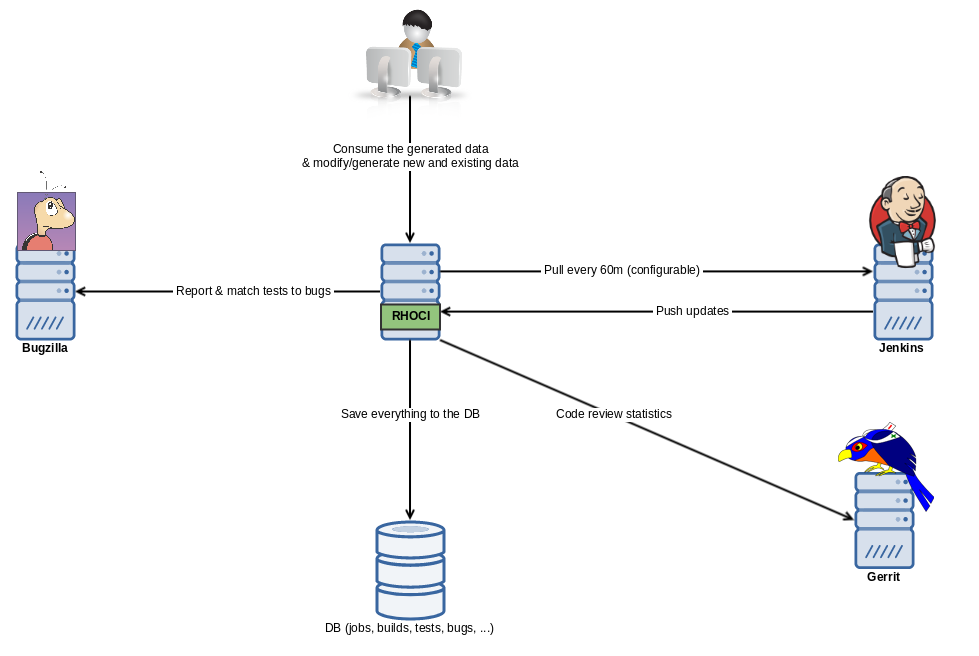
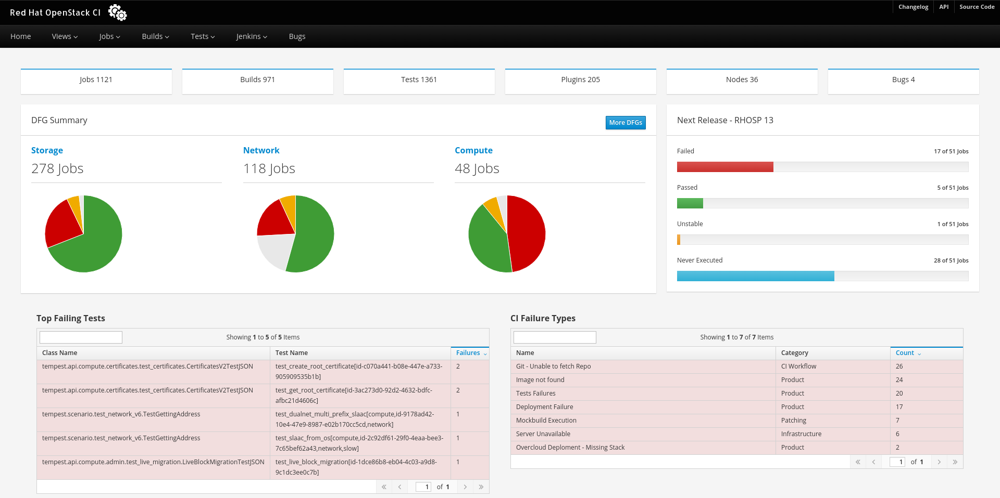
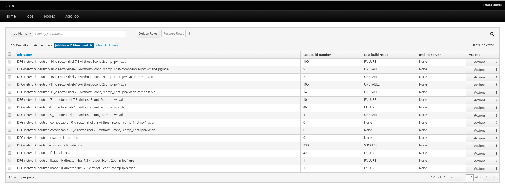

# RHOCI

RHOCI (Red Hat OpenStack CI)

A web service based on Jenkins to enhance user experience for Red Hat OpenStack CI users.
This project allows you to:

    * View all jobs in one datatable where you can filter them based on different parameters
    * View all builds in one datatable where you can filter them based on different parameters
    * View all unique tests and how many times they failed or passed
    * Generate job definitions based on given input
    * Analyze build failures

* [Requirements](#requirements)
* [Installation](#installation)
* [Getting Started](#getting-started)
* [Configuration](#configuration)
* [API](#api)

## Requirements

* Python >= 2.7

## Installation

    sudo yum install -y https://dl.fedoraproject.org/pub/epel/epel-release-latest-7.noarch.rpm
    sudo yum install -y httpd python-pip python-virtualenv gcc
    virtualenv .venv && source .venv/bin/activate
    pip install .

Make sure you allow HTTP traffic
Note that you can instead run the following two scripts

    chmod +x scripts/initial_setup.sh && scripts/initial_setup.sh
    chmod +x scripts/quick_run.sh && scripts/quick_run.sh

## Run RHOCI

    rhoci run

## Configuration 

The default location for RHOCI configuration is '/etc/rhoci/rhoci.conf'.
You can specify it by using the CLI: --conf <conf_file_path>

You can find sample in samples/rhoci.conf

## API

API is documented in /doc view and generated automatically

## The technologies behind RHOCI

* Flask
* SQLite
* Patternfly

## Overview

## Screenshots

### Home page

### Jobs page

## How to add a new page

* Create the html templates in rhoci/rhoci/templates/<new_page_name>.html
* Add a new entry in rhoci/rhoci/views/__init__.py
* Add a new view in rhoci/rhoci/views/<new_page_name>.html
* Add a new item to 'views' variable in rhoci/rhoci/web.py
* Add it to the navigation bar in rhoci/rhoci/templates/navbar.html
