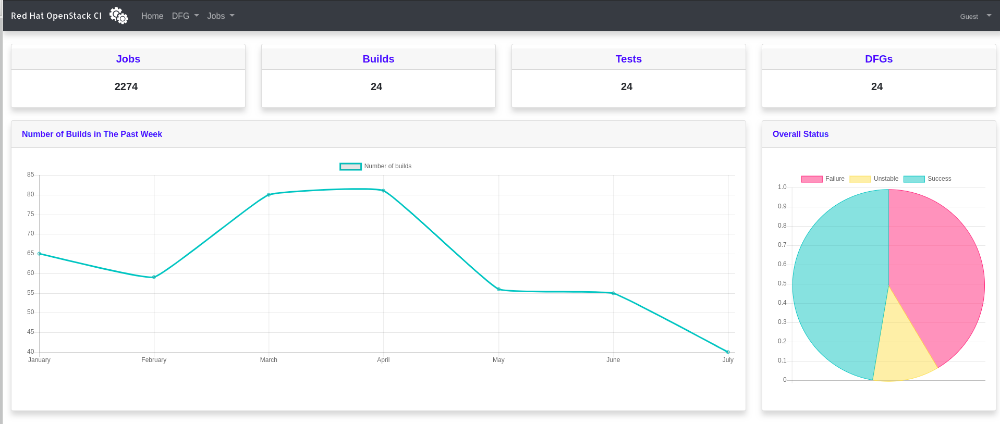

# Red Hat OpenStack CI Dashboard

RHOCI is Red Hat OpenStack CI Dashboard.

## Quick Start

Prepare your host for installing the app and running it:

    scripts/setup_rhel_host.sh

Before running the server and the agent, you first need to set up a configuration (`/etc/rhoci/rhoci.conf`)
The most basic configuration is:

    jenkins:
      url: <Jenkins URL>
      user: <Jenkins username>
      password: <Jenkins API token>

Create a virtual environment where you will install the app:

    virtualenv ~/rhoci_venv && source ~/rhoci_venv/bin/activate
    pip install -r requirements.txt
    pip install .

Once the configuration is in place, run the following command to start the server:

    rhoci-server

To run RHOCI Jenkins agent, run the following:

    rhoci-agent

## Developer Guide

Whould like to contribute to RHOCI? click [here](docs/developer.md)

## API

Route | Description
:------|:------:
/api/jobs | Show jobs details
/api/DFGs | Show DFGs details
